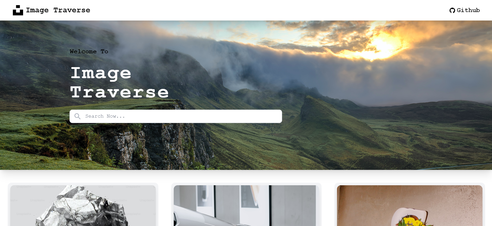
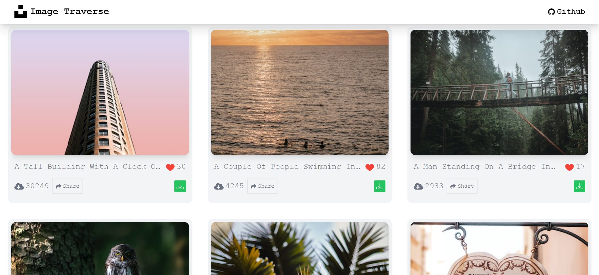
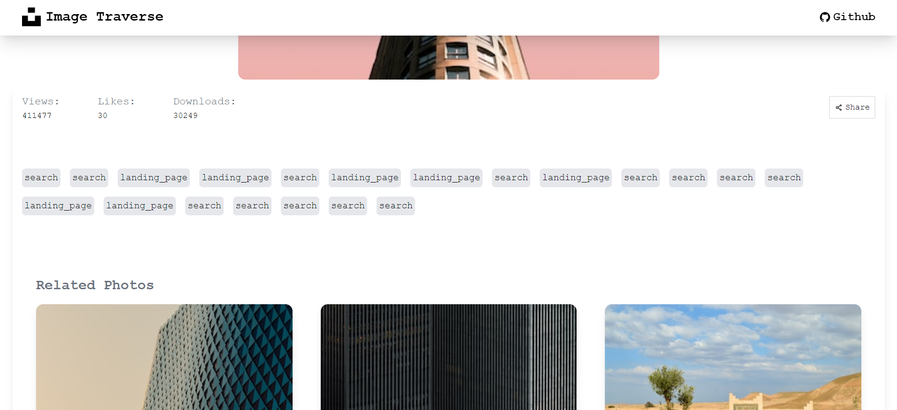

# React Image Traverse- Using Unsplash





React Image Traverse- Using Unsplash App built with React + Vite.
[Live Demo](https://image-traverse-unsplash.vercel.app)

## Tech Stack

**React, React-Router-Dom, Redux, ReduxToolkit, JavaScript, Tailwind, React-Icons, Axios**

## Features

- **List of Random Images using https://unsplash.com/documentation#get-a-randomphoto in the Index page**
- **Search component to Search Images by keyword using https://unsplash.com/documentation#search-photos APIs**
- **Photo Detail page which contain all details of photo such as (User details, Download option, Share option, Tags, Related photo etc)**
- **Download and Share Functionality In Details Page**

## Getting Started

First you need an API key from Unsplash,, you can get one by creating an developers account on their website.
After you got your API key, create a **.env.local** file at root directory of project, copy the line below to the file and replace YOUR_KEY with your Unsplash API Key.

```
VITE_UNSPLASH_API_KEY=YOUR_KEY
```

Finally clone this repository, install dependencies and run the local server

```bash
git clone https://github.com/se-surabhianand/Image-Traverse
```

```bash
cd Image-Traverse
npm install
npm run dev
```

## Credits

[Unsplash](https://unsplash.com 'Unsplash') (Photo data API)
